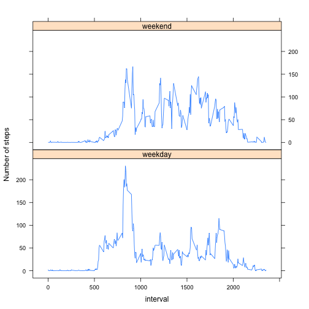

Reproducible Research: Peer Assessment 1  
========================================


## Loading and preprocessing the data  

Unzip the activity.zip file with the following code chunk:

```r
zipfile <- "activity.zip"
file <- unzip(zipfile)
```

Read in activity.csv file:

```r
data <- read.csv(file, header=TRUE)
```

Our "data" is a data frame with 17568 observations 
of 3 variables ("steps", "date" and "interval").
Show first six rows of the data file:

```r
library(xtable)
xt <- xtable(head(data))
print(xt, type="html")
```

<!-- html table generated in R 3.1.2 by xtable 1.7-4 package -->
<!-- Tue Dec  9 17:31:43 2014 -->
<table border=1>
<tr> <th>  </th> <th> steps </th> <th> date </th> <th> interval </th>  </tr>
  <tr> <td align="right"> 1 </td> <td align="right">  </td> <td> 2012-10-01 </td> <td align="right">   0 </td> </tr>
  <tr> <td align="right"> 2 </td> <td align="right">  </td> <td> 2012-10-01 </td> <td align="right">   5 </td> </tr>
  <tr> <td align="right"> 3 </td> <td align="right">  </td> <td> 2012-10-01 </td> <td align="right">  10 </td> </tr>
  <tr> <td align="right"> 4 </td> <td align="right">  </td> <td> 2012-10-01 </td> <td align="right">  15 </td> </tr>
  <tr> <td align="right"> 5 </td> <td align="right">  </td> <td> 2012-10-01 </td> <td align="right">  20 </td> </tr>
  <tr> <td align="right"> 6 </td> <td align="right">  </td> <td> 2012-10-01 </td> <td align="right">  25 </td> </tr>
   </table>
Note the missing values in variable "steps".


## What is mean total number of steps taken per day?

Calculate total number of steps taken each day:

```r
total <- aggregate(steps ~ date, data, sum)
```

Function aggregate takes steps and sums them for each day.
It outputs data frame called "total" with two variables ("date" and "steps").
This is the first six rows of the data frame "total":

```r
library(xtable)
xt <- xtable(head(total))
print(xt, type="html")
```

<!-- html table generated in R 3.1.2 by xtable 1.7-4 package -->
<!-- Tue Dec  9 17:31:43 2014 -->
<table border=1>
<tr> <th>  </th> <th> date </th> <th> steps </th>  </tr>
  <tr> <td align="right"> 1 </td> <td> 2012-10-02 </td> <td align="right"> 126 </td> </tr>
  <tr> <td align="right"> 2 </td> <td> 2012-10-03 </td> <td align="right"> 11352 </td> </tr>
  <tr> <td align="right"> 3 </td> <td> 2012-10-04 </td> <td align="right"> 12116 </td> </tr>
  <tr> <td align="right"> 4 </td> <td> 2012-10-05 </td> <td align="right"> 13294 </td> </tr>
  <tr> <td align="right"> 5 </td> <td> 2012-10-06 </td> <td align="right"> 15420 </td> </tr>
  <tr> <td align="right"> 6 </td> <td> 2012-10-07 </td> <td align="right"> 11015 </td> </tr>
   </table>


Plot histogram of the total number of steps taken each day.

```r
hist(total$steps,xlab="Total number of steps", 
     ylab="Number of days", main="")
title(main="Histogram of total number of steps")
```

 

Frequency, usually displayed on the y-axis, corresponds to
the number of days with a total number of steps specified by the 
histogram's bin. For example, one can see from the histogram 
that there are more then 25 days with total number of steps 
between 10000 and 15000.

Mean total number of steps taken per day is:

```r
mean(total$steps)
```

```
## [1] 10766.19
```

Median total number of steps taken per day is:

```r
median(total$steps)
```

```
## [1] 10765
```


## What is the average daily activity pattern?

Calculate the average number of steps taken, averaged across all days:

```r
average <- aggregate(steps ~ interval, data, mean)
```
This code chunk calculates the mean of the number of steps in the same time interval across all days.
Then, it stores values in the data frame "average". Note that days without steps in any given
5 minute interval are excluded from the calculation. In other words, sum of the number of steps
in one 5-minute interval will be divided by the total number of days which have the observations. 

Next, plot the average number of steps for all days:

```r
plot(average$interval, average$steps, type="l", xlab="Time Interval", 
     ylab="Average Number of Steps", main="")
title(main="Average Number of Steps for All Days")
```

 

Find the time interval with the maximum number of steps (averaged across all days):

```r
tmax <- average$interval[average$steps == max(average$steps)]
tmax
```

```
## [1] 835
```
Maximum average number of steps is in the time interval 835 - 840.

Convert minutes to hours:

```r
tmax/60.
```

```
## [1] 13.91667
```
Largest daily activity is around 2 pm.

## Imputing missing values

Calculate the total number of missing values in the dataset:

```r
Nna <- sum(is.na(data$steps) == "TRUE")
Nna
```

```
## [1] 2304
```
Total number of missing values in the dataset is 2304.

Next, the missing values are replaced with the mean for every 5-minute interval.
First, "split" function is used to dissect "data" file into 61 lists
of data frames ("date" is used as a splitting factor). Second, "replace" function
is used to replace the missing values in "steps" with the mean values stored in the previously
calculated "average" data frame. At the end, "unsplit" function is used to 
return lists of data frames into the original data frame.

```r
newdata <- split(data, data$date)
newdata <- lapply(newdata, function(x) {
  x$steps <- replace(x$steps, is.na(x$steps), average[is.na(x$steps),2]); 
  x
  })
newdata <- unsplit(newdata,data$date)
```
Here is what the new data looks like:

```r
library(xtable)
xt <- xtable(head(newdata))
print(xt, type="html")
```

<!-- html table generated in R 3.1.2 by xtable 1.7-4 package -->
<!-- Tue Dec  9 17:31:44 2014 -->
<table border=1>
<tr> <th>  </th> <th> steps </th> <th> date </th> <th> interval </th>  </tr>
  <tr> <td align="right"> 1 </td> <td align="right"> 1.72 </td> <td> 2012-10-01 </td> <td align="right">   0 </td> </tr>
  <tr> <td align="right"> 2 </td> <td align="right"> 0.34 </td> <td> 2012-10-01 </td> <td align="right">   5 </td> </tr>
  <tr> <td align="right"> 3 </td> <td align="right"> 0.13 </td> <td> 2012-10-01 </td> <td align="right">  10 </td> </tr>
  <tr> <td align="right"> 4 </td> <td align="right"> 0.15 </td> <td> 2012-10-01 </td> <td align="right">  15 </td> </tr>
  <tr> <td align="right"> 5 </td> <td align="right"> 0.08 </td> <td> 2012-10-01 </td> <td align="right">  20 </td> </tr>
  <tr> <td align="right"> 6 </td> <td align="right"> 2.09 </td> <td> 2012-10-01 </td> <td align="right">  25 </td> </tr>
   </table>
Note the difference between the new data set end the original data set. Missing values
have been replaced with the mean values.

Calculate total number of steps taken each day in the new data set:

```r
newtotal <- aggregate(steps ~ date, newdata, sum)
```

Plot the histogram of the total number of steps taken each day (new data set).

```r
hist(newtotal$steps,xlab="Total number of steps", ylab="Number of days", main="")
title(main="Histogram of total number of steps (new data set)")
```

 

New mean total number of steps taken per day is:

```r
mean(newtotal$steps)
```

```
## [1] 10766.19
```

New median total number of steps taken per day is:

```r
median(newtotal$steps)
```

```
## [1] 10766.19
```
Note that the new value of the median differs from the original. 
Replacing the missing data has changed the median value which is now
equal to the new mean value.


## Are there differences in activity patterns between weekdays and weekends?

Creating a new factor variable with two levels – “weekday” and “weekend” indicating whether a given date is a weekday or weekend day.

```r
days <- weekdays(as.Date(newdata$date))
days[days == "Saturday" | days == "Sunday"] <- "weekend"
days[days != "weekend"] <- "weekday"
```

Adding new variable "days" to the data set "newdata" as a new column.

```r
newdata <- data.frame(newdata, day = as.factor(days))
```

Here is what the new data looks like:

```r
library(xtable)
xt <- xtable(head(newdata))
print(xt, type="html")
```

<!-- html table generated in R 3.1.2 by xtable 1.7-4 package -->
<!-- Tue Dec  9 17:31:44 2014 -->
<table border=1>
<tr> <th>  </th> <th> steps </th> <th> date </th> <th> interval </th> <th> day </th>  </tr>
  <tr> <td align="right"> 1 </td> <td align="right"> 1.72 </td> <td> 2012-10-01 </td> <td align="right">   0 </td> <td> weekday </td> </tr>
  <tr> <td align="right"> 2 </td> <td align="right"> 0.34 </td> <td> 2012-10-01 </td> <td align="right">   5 </td> <td> weekday </td> </tr>
  <tr> <td align="right"> 3 </td> <td align="right"> 0.13 </td> <td> 2012-10-01 </td> <td align="right">  10 </td> <td> weekday </td> </tr>
  <tr> <td align="right"> 4 </td> <td align="right"> 0.15 </td> <td> 2012-10-01 </td> <td align="right">  15 </td> <td> weekday </td> </tr>
  <tr> <td align="right"> 5 </td> <td align="right"> 0.08 </td> <td> 2012-10-01 </td> <td align="right">  20 </td> <td> weekday </td> </tr>
  <tr> <td align="right"> 6 </td> <td align="right"> 2.09 </td> <td> 2012-10-01 </td> <td align="right">  25 </td> <td> weekday </td> </tr>
   </table>

Calculating the mean of the number of steps in the same time interval across all weekday days
(average_weekday), and across all weekend days (average_weekend).

```r
average_weekday <- aggregate(steps ~ interval, newdata[newdata$day == "weekday",], mean)
average_weekend <- aggregate(steps ~ interval, newdata[newdata$day == "weekend",], mean)
```


Making a panel plot containing a time series plot of the 5-minute interval (x-axis) and the average number of steps taken, averaged across all weekday days or weekend days (y-axis).

Preparing data for plotting:

Adding "day" to the "average_weekday" and "average_weekend":

```r
average_weekday <- data.frame(average_weekday, day = as.factor("weekday"))
average_weekend <- data.frame(average_weekend, day = as.factor("weekend"))
```
Binding "average_weekday" and "average_weekend" with "rbind" into a new data frame
"bind_average".

```r
bind_average <- rbind(average_weekday, average_weekend)
```
Plotting with lattice:

```r
library(lattice)
xyplot(steps ~ interval | day, data=bind_average, type="l", layout =c(1,2), ylab ="Number of steps")  
```

 

Panels show that during the week, there is more activity in the early afternoon compared to the weekend. On the weekends, there is more activity during late afternoon compared to the weekdays. 
